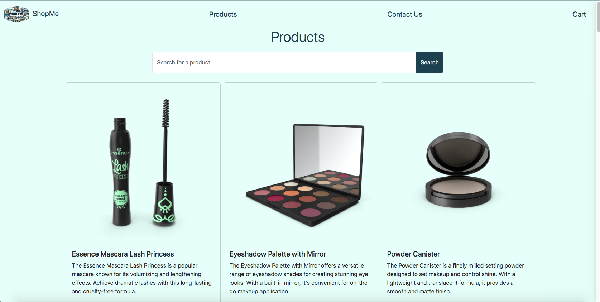

# ShopMe Online Store (MERN Capstone Project)
This MERN Capstone Project demonstrates the creation of a full-stack web application using MongoDB, Express, React, and Node.js. The application aims to meet all technical requirements, showcase complexity and creativity, provide value to users, maintain high code quality, and include appropriate comments and documentation.
Adhere to Agile principles and the Scrum framework. Perform stand-up sessions (with an instructor.Successfully track your project using  GitHub canban board.

ShopMe, is your one-stop online store for all your needs! From makeup and clothing to food, appliances, and much more, we offer a wide variety of products to cater to every aspect of your life. Enjoy a seamless shopping experience with top-quality items and unbeatable deals.

  

  

## Project Tracking

This project was tracked using GitHub Projects. The GitHub Project Board was used to manage tasks, user stories, and progress.

  

## Features
Users can interact with the application through various features as described below. These features enable users to explore and discover information about different product and use CRUD functionality in cart. 

- **Add and remove items** from the cart
- **Update item quantities** in the cart
- **searching by topic using search word**  in product page
- **Responsive design** using CSS and React components
- **Multiple views/pages** using React Router
- **State management** using React Hooks
- **RESTful API** with full CRUD functionality
- **Data fetching** using Axios or Fetch API
- **Database management** using MongoDB and Mongoose

## Technologies Used
MERN, bootstrap and dummyJSON Api

## Unsolved problems
During the deployment process I encountered an issue with Netlify. Tried to drag and drop method and aslo using github. Below shows the links.

## Build/Run
### Install dependencies for front-end
  - axios
  - bootstrap
  - express
  - mongodb
  - mongoos
  - react
  - react-bootstrap
  - react-dom
  - react-router-dom
  - react-scripts
  - web-vitals

###  Install dependencies for back-end
  - body-parser
  - cors
  - dotenv
  - express
  - nodemon
  - mongodb
  - mongoos

# Getting Started with Create node 
npm init -y 

# Getting Started with Create React App

This project was bootstrapped with [Create React App](https://github.com/facebook/create-react-app).

## Available Scripts

In the project directory, you can run:

### `npm start`

Runs the app in the development mode.\
Open [http://localhost:3000](http://localhost:3000) to view it in your browser.

The page will reload when you make changes.\
You may also see any lint errors in the console.

### `npm test`

Launches the test runner in the interactive watch mode.\
See the section about [running tests](https://facebook.github.io/create-react-app/docs/running-tests) for more information.

### `npm run build`

Builds the app for production to the `build` folder.\
It correctly bundles React in production mode and optimizes the build for the best performance.

The build is minified and the filenames include the hashes.\
Your app is ready to be deployed!

See the section about [deployment](https://facebook.github.io/create-react-app/docs/deployment) for more information.

### `npm run eject`

**Note: this is a one-way operation. Once you `eject`, you can't go back!**

If you aren't satisfied with the build tool and configuration choices, you can `eject` at any time. This command will remove the single build dependency from your project.

Instead, it will copy all the configuration files and the transitive dependencies (webpack, Babel, ESLint, etc) right into your project so you have full control over them. All of the commands except `eject` will still work, but they will point to the copied scripts so you can tweak them. At this point you're on your own.

You don't have to ever use `eject`. The curated feature set is suitable for small and middle deployments, and you shouldn't feel obligated to use this feature. However we understand that this tool wouldn't be useful if you couldn't customize it when you are ready for it.

## Learn More

You can learn more in the [Create React App documentation](https://facebook.github.io/create-react-app/docs/getting-started).

To learn React, check out the [React documentation](https://reactjs.org/).

### Code Splitting

This section has moved here: [https://facebook.github.io/create-react-app/docs/code-splitting](https://facebook.github.io/create-react-app/docs/code-splitting)

### Analyzing the Bundle Size

This section has moved here: [https://facebook.github.io/create-react-app/docs/analyzing-the-bundle-size](https://facebook.github.io/create-react-app/docs/analyzing-the-bundle-size)

### Making a Progressive Web App

This section has moved here: [https://facebook.github.io/create-react-app/docs/making-a-progressive-web-app](https://facebook.github.io/create-react-app/docs/making-a-progressive-web-app)

### Advanced Configuration

This section has moved here: [https://facebook.github.io/create-react-app/docs/advanced-configuration](https://facebook.github.io/create-react-app/docs/advanced-configuration)

### Deployment

This section has moved here: [https://facebook.github.io/create-react-app/docs/deployment](https://facebook.github.io/create-react-app/docs/deployment)

### `npm run build` fails to minify

This section has moved here: [https://facebook.github.io/create-react-app/docs/troubleshooting#npm-run-build-fails-to-minify](https://facebook.github.io/create-react-app/docs/troubleshooting#npm-run-build-fails-to-minify)
